# Hi 👋, I'm Mahima Jivan Jain

<div align="center">
  
</div>

<div align="center">
  


</div>

---

## 🚀 About Me

```python
class MahimaJain:
    def __init__(self):
        self.name = "Mahima Jivan Jain"
        self.role = "Frontend Developer"
        self.location = "India 🇮🇳"
        self.languages = ["C", "C++", "Java", "Python", "HTML"]
        self.currently_learning = ["DSA in Java", "Python", "Advanced Java"]
        self.ask_me_about = ["C", "C++", "HTML", "Problem Solving"]
        self.reach_me = "mahimajain01302@gmail.com"
        self.motto = "Code with passion, debug with patience! 💻"
    
    def get_daily_routine(self):
        return {
            "morning": "☕ Coffee + Code review",
            "afternoon": "💻 DSA practice & development",
            "evening": "📚 Learning new technologies",
            "night": "🌙 Open source contributions"
        }
    
    def current_goals(self):
        return [
            "Master Data Structures & Algorithms",
            "Build amazing frontend projects",
            "Contribute to open source",
            "Learn advanced frameworks"
        ]

mahima = MahimaJain()
print(f"Hello World! I'm {mahima.name} 👋")
```

## 🌟 Current Journey

- 🌱 **Currently Learning:** DSA in Java, Python, Advanced Java concepts
- 💻 **Working on:** Frontend development projects and algorithmic problem solving
- 💬 **Ask me about:** C, C++, HTML, Data Structures, Problem-solving techniques
- 📫 **Reach me at:** mahimajain01302@gmail.com
- 🎯 **Goal:** To become a full-stack developer and contribute to meaningful projects
- ⚡ **Fun fact:** I can spend hours debugging and still love coding! 😄

---

## 🛠️ Tech Arsenal

<div align="center">

### Programming Languages


### Frontend Technologies


### Tools & Platforms


### IDEs & Editors


</div>

---

## 📊 GitHub Analytics

<div align="center">
  
  
</div>

<div align="center">
  
</div>

---

## 🏆 GitHub Trophies

<div align="center">
  
</div>

---

## 📈 Contribution Graph

<div align="center">
  
</div>

---

## 💼 Featured Projects

<div align="center">

[](https://github.com/mahimajain01302-boop/dsa-practice)
[](https://github.com/mahimajain01302-boop/frontend-projects)

</div>

---

## 🎯 Learning Path

```mermaid
graph TD
    A[🎓 Current Skills] --> B[C/C++ Fundamentals]
    A --> C[HTML/CSS Basics]
    A --> D[Java Programming]
    
    B --> E[🚀 Advancing To]
    C --> E
    D --> E
    
    E --> F[Data Structures & Algorithms]
    E --> G[Advanced Java]
    E --> H[Python for Development]
    E --> I[JavaScript & Frameworks]
    
    F --> J[🎯 Future Goals]
    G --> J
    H --> J
    I --> J
    
    J --> K[Full Stack Development]
    J --> L[Open Source Contributions]
    J --> M[System Design]
```



---

## 📚 Study Schedule

| Time | Activity | Focus Area |
|------|----------|------------|
| 🌅 Morning | DSA Practice | Problem Solving |
| 🌞 Afternoon | Project Development | Frontend Skills |
| 🌆 Evening | Learning New Concepts | Technology Exploration |
| 🌙 Night | Code Review & Documentation | Best Practices |

---

## 🔥 Streak Stats

<div align="center">
  


</div>

---

## 💡 Problem Solving Stats

<div align="center">

| Platform | Problems Solved | Rank |
|----------|-----------------|------|
| 🟢 **LeetCode** | 150+ | Specialist |
| 🔵 **CodeChef** | 80+ | 3⭐ |
| 🟡 **HackerRank** | 120+ | Gold Badge |
| 🟠 **GeeksforGeeks** | 200+ | Expert |

</div>

---

## 🌟 Skills Progress

<div align="center">

**Programming Languages**
- C/C++ ████████████████████░ 80%
- Java ██████████████████░░░ 70%
- Python ████████████████░░░░ 65%
- HTML/CSS ██████████████████░░ 75%

**Concepts**
- Data Structures ███████████████░░░░░ 60%
- Algorithms ██████████████░░░░░░ 55%
- Object-Oriented Programming ████████████████░░░░ 70%
- Problem Solving ████████████████████░ 85%

</div>

---

## 🤝 Connect With Me

<div align="center">

[](mailto:mahimajain01302@gmail.com)
[](https://linkedin.com/in/mahima-jain)
[](https://github.com/mahimajain01302-boop)
[](https://mahima-portfolio.com)
[](https://instagram.com/mahima_jain)
[](https://twitter.com/mahima_jain)

</div>

---

## 📝 Latest Blog Posts

<!-- BLOG-POST-LIST:START -->
- 🚀 [Mastering Data Structures: A Beginner's Journey](https://your-blog.com)
- 💡 [C++ vs Java: Which One to Choose for DSA?](https://your-blog.com)
- 🎯 [Problem Solving Strategies for Competitive Programming](https://your-blog.com)
- 🌟 [Building Your First Frontend Project](https://your-blog.com)
<!-- BLOG-POST-LIST:END -->

---

## 📊 Weekly Development Breakdown

<!--START_SECTION:waka-->
```text
Java         6 hrs 30 mins   ████████████▓░░░░░░░░░░   42.5%
C++          4 hrs 15 mins   ████████▓░░░░░░░░░░░░░░   28.2%
Python       2 hrs 45 mins   ████▓░░░░░░░░░░░░░░░░░░   18.1%
HTML/CSS     1 hr 20 mins    ██▓░░░░░░░░░░░░░░░░░░░░    8.9%
Other        25 mins         ▓░░░░░░░░░░░░░░░░░░░░░░    2.3%
```
<!--END_SECTION:waka-->

---

## 🎨 Fun Corner

<div align="center">

```
     ╔═══════════════════════════════╗
     ║  while(!(succeed = try()));   ║
     ║     // Life motto in code     ║
     ╚═══════════════════════════════╝
```

**Random Dev Quote:**
> "Code is like humor. When you have to explain it, it's bad." - Cory House

</div>

---

<div align="center">
  
  
  
  ### 💫 "The best way to predict the future is to invent it." - Alan Kay
  
  **Let's code something amazing together! 🚀**
  
  
  
</div>

---

<div align="center">
  
</div>

<div align="center">
  
  **⭐ Star my repositories if you find them helpful! ⭐**
  
  
  
</div>
